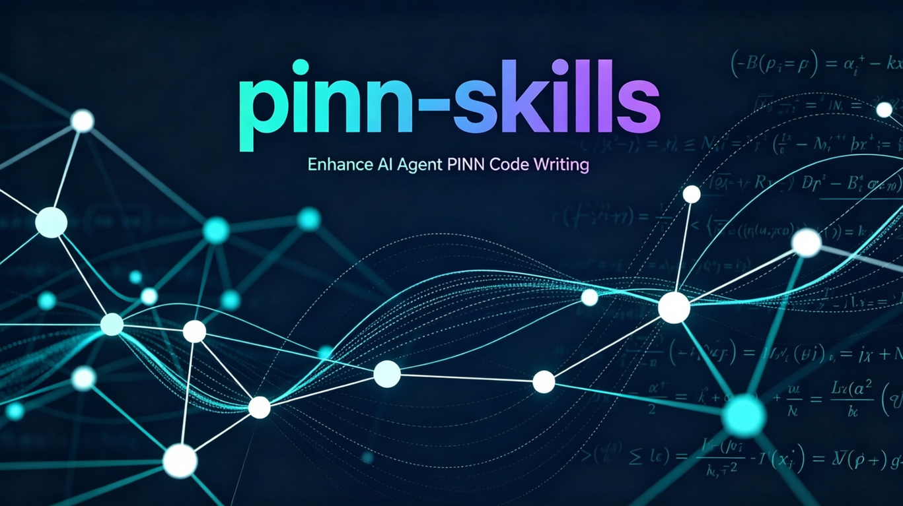

# pinn-skills — Enhance Agent's PINN Coding by 8 Steps

[](LICENSE)
[](https://star-history.com/#JinglaiZheng/pinn-skills&Date)



A Claude Code skill that helps researchers and engineers build robust, high-accuracy
Physics-Informed Neural Networks (PINNs) using PyTorch.

This skill synthesizes findings from two foundational works:
- **[Wang et al. (2023)](https://arxiv.org/abs/2308.08468)** — "An Expert's Guide to Training PINNs":
  training pipeline, spectral bias mitigation, causal training, loss balancing, and architecture design
- **[Hao et al. (2024)](https://github.com/i207M/PINNacle)** — "PINNacle: A Comprehensive Benchmark":
  systematic comparison of 10+ PINN methods across 22 PDEs with problem-specific recommendations

Together, these enable an 8-step standardized workflow from problem analysis to model improvement,
with evidence-based method selection for different PDE types.

## Star History

[](https://star-history.com/#JinglaiZheng/pinn-skills&Date)

## What This Skill Does

- **Systematic 8-step workflow**: Problem analysis → Model planning → Code writing →
  Code checking → Reference solver → Results analysis → Visualization → Model improvement
- **Embeds SOTA techniques**: Fourier feature embeddings, causal training, loss
  balancing, random weight factorization, modified MLP, curriculum training
- **Evidence-based method selection**: Problem-specific recommendations from the
  PINNacle benchmark — which methods work best for complex geometry, multi-scale,
  nonlinear, high-dimensional, and inverse problems
- **Prevents common mistakes**: Input non-dimensionalization, activation selection,
  gradient handling, sampling strategies
- **Diagnostic-driven improvement**: When accuracy is insufficient, systematically
  applies improvement techniques in priority order based on ablation study evidence

## The 8-Step PINN Workflow

The skill guides the agent through a standardized pipeline:

| Step | Name | What Happens |
|------|------|-------------|
| 1 | **Problem Analysis** | Classify the PDE type (elliptic/parabolic/hyperbolic), identify domain, boundary conditions, and difficulty factors (shocks, stiffness, chaos) |
| 2 | **Model Planning** | Select architecture (MLP / Modified MLP), Fourier features, loss balancing strategy, and training algorithm based on problem classification and PINNacle benchmark recommendations |
| 3 | **Code Writing** | Generate complete PyTorch PINN code with non-dimensionalization, proper gradient handling, causal training, and adaptive loss weighting |
| 4 | **Code Checking** | Verify input normalization, derivative computation, activation choice, loss term isolation, and BC enforcement against a 12-point checklist |
| 5 | **Reference Solver** | Write an independent numerical solver (FEM, finite difference, or spectral) to produce ground-truth reference solutions for error computation |
| 6 | **Results Analysis** | Compute relative L2 error, absolute L∞ error, plot loss convergence curves, and diagnose training pathologies |
| 7 | **Visualization** | Generate publication-quality comparison plots, error field heatmaps, and loss/weight evolution curves |
| 8 | **Model Improvement** | Systematically apply fixes in priority order: Fourier features → loss balancing → causal training → modified MLP → curriculum training → hard BC constraints → hyperparameter tuning → adaptive sampling |

## Installation

### Method 1: Install from .skill file

```bash
# Download the latest pinn.skill from Releases, then:
claude skills install pinn.skill
```

### Method 2: Manual installation

```bash
# Clone into your Claude Code skills directory
mkdir -p ~/.claude/skills
cd ~/.claude/skills
git clone https://github.com/JinglaiZheng/pinn-skills.git pinn
```

### Method 3: Copy locally

```bash
cp -r pinn/ ~/.claude/skills/pinn/
```

## When It Triggers

This skill automatically activates when the user mentions:
- PINN, physics-informed neural networks
- Physics-informed machine learning
- Scientific machine learning (SciML)
- Solving PDEs with neural networks
- Training difficulties or low accuracy with existing PINN models

## File Structure

```
pinn/
├── SKILL.md                          # Main workflow (8 steps)
├── references/
│   ├── pinn_techniques.md            # 9 categories of improvement techniques
│   ├── expert_guide.md               # Detailed summary of Wang et al. (2023)
│   ├── pinnacle_benchmark.md         # Summary of Hao et al. PINNacle (NeurIPS 2024)
│   ├── expert_guide_paper.pdf        # Wang et al. original paper
│   └── pinnacle_paper.pdf            # PINNacle original paper
├── scripts/
│   └── star_chart.py                 # Generate star history chart
├── data/
│   └── stars.json                    # Star count history (auto-updated daily)
├── .github/workflows/
│   └── star-tracker.yml              # Auto-track stars daily via GitHub Actions
├── star_chart.png                    # Auto-generated star history chart
├── README.md
└── LICENSE
```

## Key Techniques Covered (from Wang et al. 2023)

| Technique | Impact | When to Use |
|-----------|--------|-------------|
| Fourier Feature Embeddings | Up to 745× error reduction | Always |
| Causal Training | Prevents causality violation | Time-dependent PDEs |
| Gradient-Norm Loss Balancing | Prevents unbalanced gradients | Always |
| Random Weight Factorization | 10-50% error reduction | Almost always |
| Modified MLP | 2-21× error reduction | Nonlinear PDEs |
| Curriculum Training | Enables long-time/chaotic simulation | Stiff/chaotic problems |
| Hard BC Constraints | Eliminates BC loss term | When feasible |

## Problem-Specific Method Selection (from PINNacle Benchmark)

| Challenge | Best Methods | Example PDEs |
|-----------|-------------|--------------|
| Complex Geometry | FBPINN, PINN-NTK, RAR | Poisson-CG, Heat-CG |
| Multi-Scale | MultiAdam, FBPINN, PINN-LRA | Poisson-MS, Heat-MS |
| Nonlinear / Chaotic | LAAF, FBPINN, MultiAdam | Navier-Stokes, KS, Gray-Scott |
| High Dimensional | LBFGS | Poisson-Nd, Heat-Nd |
| Inverse Problems | vPINN | Coefficient reconstruction |
| Parametric PDEs | PINN-NTK | Varying-parameter families |

## References

This skill is built upon two key papers. If you use this skill in your research, please cite:

```bibtex
@article{wang2023expert,
  title   = {An Expert's Guide to Training Physics-Informed Neural Networks},
  author  = {Wang, Sifan and Sankaran, Shyam and Wang, Hanwen and Perdikaris, Paris},
  journal = {arXiv preprint arXiv:2308.08468},
  year    = {2023}
}

@inproceedings{hao2024pinnacle,
  title     = {PINNacle: A Comprehensive Benchmark of Physics-Informed Neural Networks
               for Solving PDEs},
  author    = {Hao, Zhongkai and Yao, Jiachen and Su, Chang and Su, Hang and Wang, Ziao
               and Lu, Fanzhi and Xia, Zeyu and Zhang, Yichi and Liu, Songming and Lu, Lu
               and Zhu, Jun},
  booktitle = {Advances in Neural Information Processing Systems (NeurIPS)},
  year      = {2024},
  note      = {Track on Datasets and Benchmarks}
}
```

## License

MIT — See [LICENSE](LICENSE) for details.
